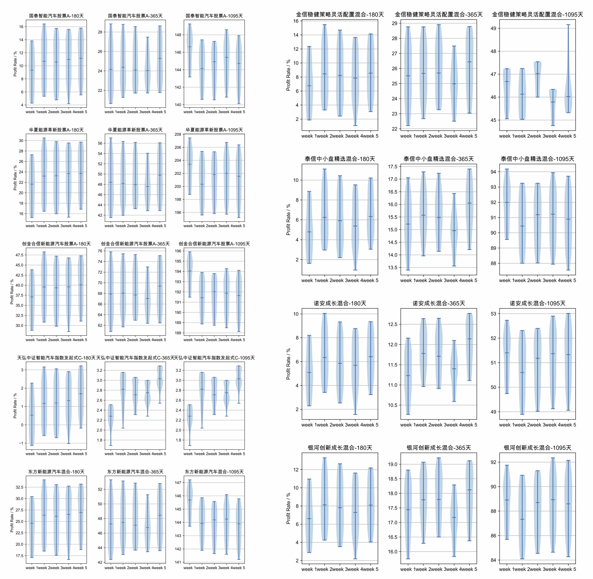

<h1 align="center">
  <br>
  <a href="https://github.com/WalleDong/ChickenFarm"></a>
</h1>
<h4 align="center">一家小小的养鸡场 </h4>


<p align="center">
    <a>
      
    </a>
    <a>
      
    </a>
    <a href="https://github.com/WalleDong/ChickenFarm/graphs/commit-activity">
      
    </a>
    <a href="https://github.com/WalleDong/ChickenFarm/issues">
      
    </a>
    <a href="https://github.com/WalleDong/ChickenFarm/pulls">
      
    </a>
  </p>


<p align="center">
  <a href="#Features">Features</a> •
  <a href="#Installation">Installation</a> •
  <a href="#Usage">Usage</a> •
  <a href="#Todo">Todo</a> •
  <a href="#Contribute">Contribute</a> •
  <a href="#Community">Community</a> •
  <a href="#License">License</a>
</p>

非专业养鸡场:baby_chick::hatched_chick::hatching_chick:，统计购买和卖出操作，分析持仓和收益，爬取基金净值，使用各种定投算法回测分析，生成投资策略。所有功能一键式全自动完成 :chart_with_upwards_trend::chart_with_upwards_trend::chart_with_upwards_trend:


# Features
- 全自动数据采集（天天基金购买记录、最新持仓采集）
- 爬取最新基金净值
- [个人数据分析](#个人数据统计图)
- [定投回测分析](#定投分析图)


# Installation

### 0、申请 Mysql 数据库
推荐 [阿里云](https://cn.aliyun.com/product/rds/mysql)，一年19.9，阿里云打:moneybag:

### 1、填写配置表
将 [配置表(farmConfig.json)](./farmConfig.json) 移动到项目目录外，按照注释填写配置表。**该表涉及账号密码，请勿提交此表！！！**

### 2、配置环境变量
```shell
echo "export PYTHONPATH=$PYTHONPATH:<项目所在的父目录>" >> ~/.bash_profile
echo "export FARM_CONFIG_PATH=<配置表(farmConfig.json)路径>" >> ~/.bash_profile
echo "export OPERATION_KEY=<操作key, 与配置表中保持一致>" >> ~/.bash_profile
source ~/.bash_profile
```

### 3、安装依赖包
```shell
python -m pip install requirements.txt
```
# Usage

### CLI

| command                                    | help                 |
| :----------------------------------------- | :------------------- |
| chick --netvalue                           | 更新基金历史净值数据 |
| chick --buy -code <code> -amount <amount>  | 买入基金             |
| chick --sell -code <code> -amount <amount> | 卖出基金             |


### 每周任务

0. 新买一个基金，需添加
1. 将支付宝的基金最新净值填入 position.csv 中
2. 执行基础任务
3. 执行回测分析


1、更新净值数据库(一键)                         python cli/farm.py -n                   
2、将本周的交易记录下来   

  0) 先把支付宝里卖的手动处理，填写csv后                
  1) 自动记录本周交易操作                       python cli/farmer.py -roa
  2) 自动记录最新持仓                           python cli/farmer.py -pa
被选:

    1）处理加仓，一条一条基金执行                   python cli/farmer.py -b -c <code> -a <amount>
    2）处理卖出，一条一条基金执行                   python cli/farmer.py -s -c <code> -a <amount>
    3）更新持仓，现将基金的最新持仓维护至 position.csv 中，然后运行  python cli/farmer.py -pl              
3、统计并记录本周各个领域的投入、持仓、收益(一键)    python cli/farmer.py -record
4、导出个人数据统计表(一键)                       python cli/farmer.py -tables
5、导出个人数据统计图(一键)                       python cli/farmer.py -charts                 
6、更新回测分析数据(一键)                        python cli/farmer.py -bt
7、导出回测分析图表(一键)                        python cli/farmer.py -draw

### 个人数据统计图


### 定投分析图




# Todo

- [ ] 支持目标止盈、移动止盈等多种投资算法
- [ ] 自动生成投资策略


# Contribute

Contributions are always welcome!
Please read the [contribution guidelines](https://github.com/WalleDong/ChickenFarm/blob/main/docs/contribution.md).:relaxed:

# Community

[](./docs/images/wechat.JPG)

# License

[](https://github.com/WalleDong/ChickenFarm/blob/main/LICENSE)

Copyright © 2021 [Walle Dong](https://github.com/WalleDong). All rights reserved.
