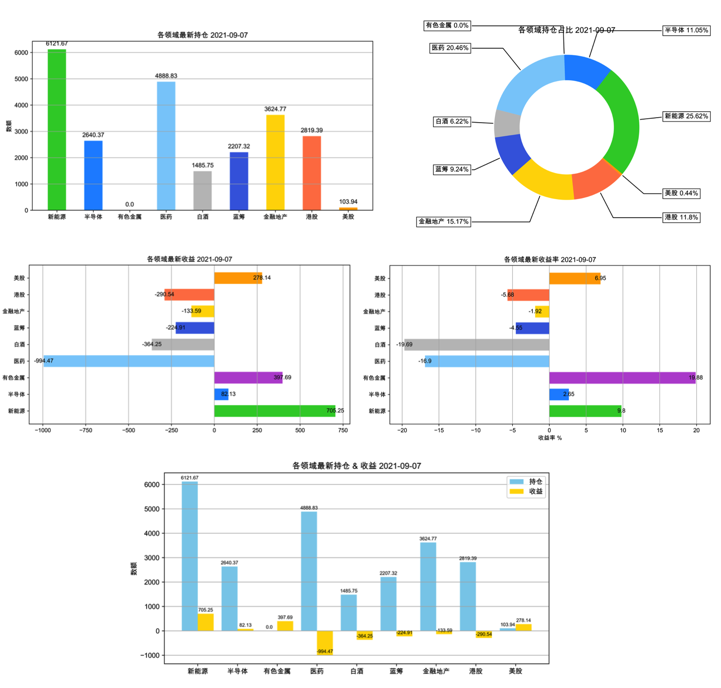
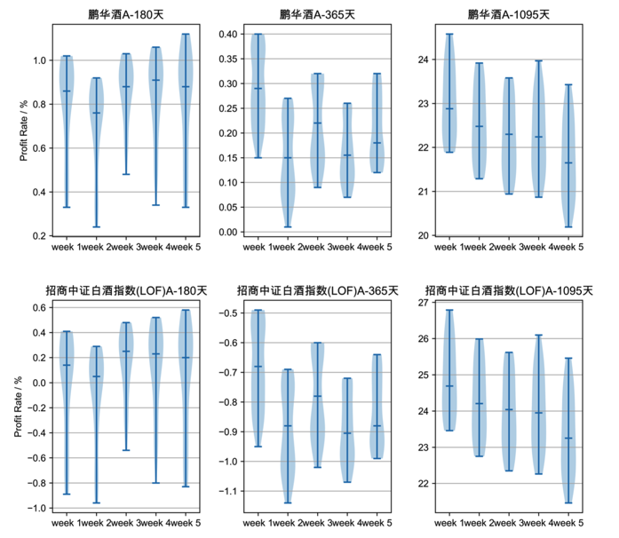
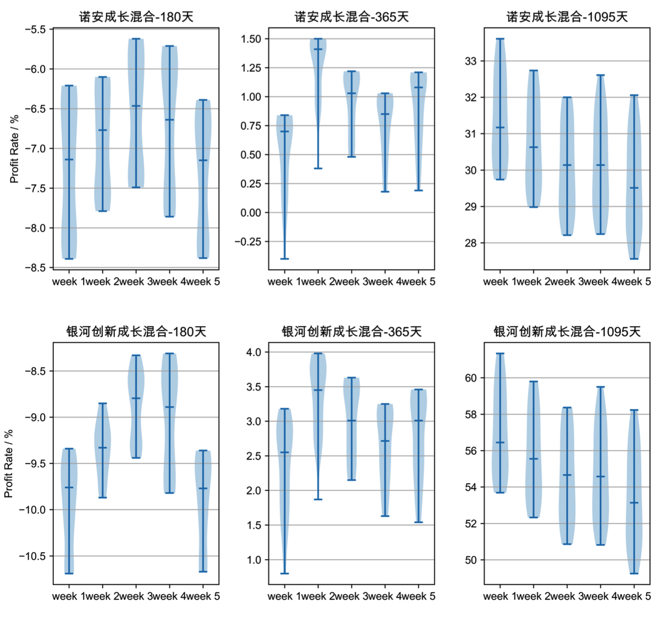
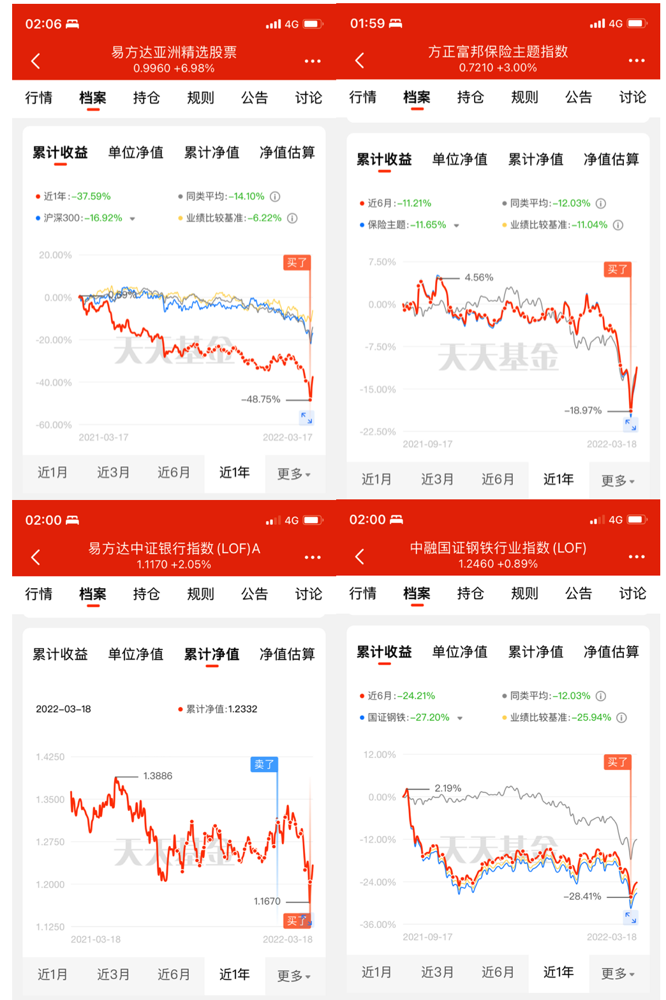

<h1 align="center">
  <br>
  <a href="https://github.com/WalleDong/ChickenFarm"></a>
</h1>
<h4 align="center">一家小小的养鸡场 </h4>

<p align="center">
    <a>
      
    </a>
    <a>
      
    </a>
    <a href="https://github.com/dowalle/ChickenFarm/graphs/commit-activity">
      
    </a>
    <a href="https://github.com/dowalle/ChickenFarm/issues">
      
    </a>
    <a href="https://github.com/dowalle/ChickenFarm/pulls">
      
    </a>
    <a>
      
    </a>
    <a>
      
    </a>
  </p>
<p align="center">
  <a href="#Features">Features</a> •
  <a href="#Installation">Installation</a> •
  <a href="#Usage">Usage</a> •
  <a href="#Todo">Todo</a> •
  <a href="#Contribute">Contribute</a> •
  <a href="#Community">Community</a> •
  <a href="#License">License</a>
</p>

非专业养鸡场:hatching_chick::hatched_chick::baby_chick:，统计购买和卖出操作，分析持仓和收益，爬取基金净值，使用各种定投算法回测分析，生成投资策略 :chart_with_upwards_trend::chart_with_upwards_trend::chart_with_upwards_trend:

## Features
- 全自动数据采集（天天基金购买记录、最新持仓采集）
- 爬取最新基金净值
- [个人数据分析](#个人数据统计图)
- [定投回测分析](#定投分析图)

## Installation

### 1、准备 Mysql 数据库

1. 创建数据库 **db_fund**，使用[sql文件](./sql/DDL_db_fund.sql)整库建表
2. 数据库 **db_netvalue**，无需建表
3. 数据库 **db_backtest**，无需建表

### 2、填写配置表

将 [配置文件(config.yaml)](./config.yaml) ，按照注释填写配置表。

### 3、配置环境变量

```shell
echo "export PYTHONPATH=$PYTHONPATH:<项目所在的父目录>" >> ~/.bash_profile
echo "export FARM_CONFIG_PATH=<配置文件(config.yaml)路径" >> ~/.bash_profile
source ~/.bash_profile
```

将 `<>` 替换成自己的配置

### 4、安装依赖包

```shell
python -m pip install -r requirements.txt
```

> [!IMPORTANT]
>
> 每年都需要更新一下 chinesecalendar 包
>
> ```bash
> pip install chinesecalendar
> pip install -U xalpha
> ```

ChromeDriver 下载，需要与Chrome版本对应

https://developer.chrome.com/docs/chromedriver/downloads

cp chromedriver-mac-x64/chromedriver /usr/local/bin

## Usage

### 回测

将需要分析的基金添加至数据库（之后不用再添加），根据提示选择分类

```shell
python chick.py -add -c `code`
```

执行回测分析任务

```shell
python chick.py -job backtest_job
```

1. 把基金的历史净值上传至 db_netvalue 数据库中
2. 更新回测分析数据
3. 导出回测分析图表

### 个人数据分析

执行个人数据分析任务

```shell
python chick.py -job base_job
```

1. 更新本周的操作记录，
2. 更新本周所有基金的持仓
3. 统计并记录本周各个领域的持仓、收益
4. 导出个人数据统计表
5. 导出个人数据统计图

### 二、CLI

```shell
python chick.py
```

#### 1、操作

| command                         | help                                           |
| :------------------------------ | :--------------------------------------------- |
| -add -c `code`                  | 添加基金                                       |
| -delete -c `code`               | 删除基金（回测）                                       |
| -assets            | 从天天基金获取最新资产数据，更新至数据库中         |

#### 2、个人数据分析

| command         | help                                                         |
| :-------------- | :----------------------------------------------------------- |
| -record | 统计并记录各个领域以及总的投入、持仓、收益历史               |
| -tables         | 导出基金最新数据总表、每个领域合计表、历史购买表、历史仓位表、历史收益表 |
| -charts         | 绘制个人数据图表                                             |
| -show                           | 展示基金数据和图表                           |

#### 3、回测分析

| command         | help                         |
| :-------------- | :--------------------------- |
| -netvalue       | 更新基金历史净值数据         |
| -backtest       | 回测，并将回测数据上传       |
| -plots | 绘制各领域基金回测的小提琴图 |

### 三、个人数据统计

- 各领域最新持仓图
- 各领域持仓占比图
- 各领域最新收益图
- 各领域最新收益率图
- 各领域最新持仓 & 收益图



### 四、定投分析

> 下面实现的定投方法，仅为一种「最简单的思路」，抛砖引玉
>

选择一周中的固定一天（周一至周五），每周以固定的资金进行买入，在近半年、近一年、近三年的时间跨度进行定投回测，回测结果绘制出小提琴图。

- 每一行，为一个基金的180天、365天、1095天区间的回测分析
- 每一列，为一类基金的相同天数回测分析，**可判断不同基金的定投收益**
- 子图为一周五天的小提琴图，中间横线为中位数，上、下端横线为极值，**可分析选择周内的哪一天定投收益高**
- 小提琴图中宽的地方为概率密度大的地方，也就是多数样本分布的地方，也就是**最有可能获得的收益率**

注：定投的起点，也就是开始定投的日子对最终的收益有很大的影响。所以，并没有直接用距今天180天前的那一天开始算单一结果，而是取距今天180天前那一天的「附近区间的多个起点」，统计出多个样本来绘制「Violin Plot」。

例：白酒和半导体的一些基金回测分析





按照策略进行的实际定投情况，大多数买在了相对较低的点上



## Contribute

Contributions are always welcome!
Please read the [contribution guidelines](https://github.com/WalleDong/ChickenFarm/blob/main/docs/contribution.md).:relaxed:

## Community

[](./docs/images/wechat.JPG)

## License

[](https://github.com/WalleDong/ChickenFarm/blob/main/LICENSE)

Copyright © 2022 [Do Walle](https://github.com/dowalle). All rights reserved.
